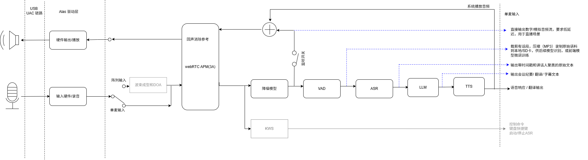

# AX650 音频链路 SDK

AX Audio SDK 是面向 AX650 板端的实时会议音频处理链路。它把 ALSA 采集、WebRTC
AudioProcessing（APM）、NPU 降噪、语音活动检测（TEN-VAD）、SenseVoice 语音识别和
音频归档、Qwen3-1.7B 文本生成和 Hojo 语音合成组合成一个可部署的工程。板端主程序是原生 C++，启动时只依赖板端动态库和
模型；Python/Gradio 用于配置页面和随 `run-target.sh` 启动的运行状态页面。

## 1. 总体架构



## 快速开始

下面以 Ubuntu/Debian x86_64 开发机、可通过 SSH 访问的 AX650 板卡为例。编译产物只能
在 AArch64 AX650 板端运行。板端固件、AX Engine 动态库和编译时使用的 AX650 Board
SDK 应保持同一版本，并确认板端已切换为 `BIG_LITTLE`（2+1）VNPU 模式；切换模式后
按板端提示重启。

### 1. 准备开发机

安装 Git、CMake、AArch64 交叉编译器及 ARM64 ALSA 开发包：

```bash
sudo dpkg --add-architecture arm64
sudo apt-get update
sudo apt-get install -y \
  build-essential cmake curl file git git-lfs openssh-client tar unzip \
  gcc-aarch64-linux-gnu g++-aarch64-linux-gnu libasound2-dev:arm64
git lfs install
```

上述包会提供 `aarch64-linux-gnu-gcc/g++`、ALSA 头文件及通常位于
`/usr/lib/aarch64-linux-gnu/libasound.so` 的 ARM64 链接库。用下面的命令确认，而不要把
x86_64 的 `libasound.so` 传给交叉编译器：

```bash
aarch64-linux-gnu-g++ --version
cmake --version
dpkg -L libasound2-dev:arm64 | grep '/libasound\.so$'
```

如果开发机发行版不支持 Multi-Arch，也可使用与板端匹配的 AArch64 sysroot；其中必须
包含 `alsa/asoundlib.h` 和 ARM64 `libasound.so`，编译时分别通过
`ALSA_INCLUDE_DIR`、`ALSA_LIBRARY` 指定。

安装 [uv](https://docs.astral.sh/uv/getting-started/installation/)；它用于配置页面和运行
状态页面，不参与 C++ 交叉编译：

```bash
curl -LsSf https://astral.sh/uv/install.sh | sh
export PATH="$HOME/.local/bin:$PATH"
uv --version
```

### 2. 获取源码、模型和 AX650 Board SDK

```bash
git clone https://github.com/AXERA-TECH/asr-llm-tts-chain.git ax-audio-sdk
cd ax-audio-sdk

# 模型包含大文件；先安装 Git Xet，再克隆到固定目录名。
curl --proto '=https' --tlsv1.2 -sSf \
  https://raw.githubusercontent.com/huggingface/xet-core/refs/heads/main/git_xet/install.sh | sh
export PATH="$HOME/.local/bin:$PATH"
git xet install
git clone https://huggingface.co/AXERA-TECH/models-for-asr-chain

# 创建 Python 3.12 虚拟环境并按 uv.lock 安装配置页面的依赖。
uv sync --locked
```

模型克隆完成后应存在
`models-for-asr-chain/asr/sensevoice/sensevoice.axmodel`、
`models-for-asr-chain/llm/qwen3-1.7b/` 和
`models-for-asr-chain/tts/hojo/models/`，不能只有 Xet 指针文件。

从板卡厂商提供的、与板端固件匹配的 SDK 包获取 `include/` 和 `lib/`。AX-Pi Pro
可参考官方 [AX650N BSP SDK](https://github.com/AXERA-TECH/ax650n_bsp_sdk)；下面的版本
只是公开示例，实际项目应优先使用板端配套版本：

```bash
mkdir -p "$HOME/opt"
git clone --depth 1 --branch v1.45.0_p39 \
  https://github.com/AXERA-TECH/ax650n_bsp_sdk.git "$HOME/opt/ax650n_bsp_sdk"
export AX650_SDK_ROOT="$HOME/opt/ax650n_bsp_sdk/msp/out"
test -d "$AX650_SDK_ROOT/include" && test -d "$AX650_SDK_ROOT/lib"
```

### 3. 交叉编译

使用明确的 SDK 和 ARM64 ALSA 库路径执行整体构建：

```bash
export AX650_SDK_ROOT="$HOME/opt/ax650n_bsp_sdk/msp/out"
export ALSA_INCLUDE_DIR=/usr/include
export ALSA_LIBRARY=/usr/lib/aarch64-linux-gnu/libasound.so
CC=aarch64-linux-gnu-gcc \
CXX=aarch64-linux-gnu-g++ \
./scripts/build.sh
```

构建结束后确认五个生产产物齐全，且可执行文件均为 AArch64：

```bash
test -x build/audio-pipeline
test -x build/run-alsa-apm
test -f build/libfastenhance.so
test -x build/qwen3-worker
test -x build/hojo-tts-resident
file build/audio-pipeline build/run-alsa-apm build/qwen3-worker build/hojo-tts-resident
```

若 `build.sh` 显示 `skipped run-alsa-apm`，说明 ALSA 头文件或 `ALSA_LIBRARY` 不正确；
若显示 `skipped AX650 runtime components`，说明 `AX650_SDK_ROOT` 下缺少 `include/` 或
`lib/`。这两种情况都不能部署完整实时链路。

### 4. 准备板端并部署

首次部署前，先在 AX650 板端安装 ALSA 工具、MP3 编码器和 `uv`。以下命令假定以
`root` 登录，因此不使用 `sudo`：

```bash
apt-get update
apt-get install -y alsa-utils ca-certificates curl lame
curl -LsSf https://astral.sh/uv/install.sh | env UV_INSTALL_DIR=/usr/local/bin sh
uv --version
```

如果板端软件源没有 `lame`，也可安装带 `libmp3lame` 编码器的 FFmpeg；没有 MP3
编码器时，识别仍可运行，但话段不会归档为 MP3。这里把 `uv` 安装到
`/usr/local/bin`，确保部署脚本的非交互 SSH 会话也能找到它。`uv` 必须在第一次部署前
可用，因为部署脚本最后会在板端执行依赖检查。

回到开发机，推荐先配置 SSH 公钥，然后增量部署。将示例 IP 和目录替换为实际值：

```bash
ssh-copy-id root@192.168.1.100
TARGET=root@192.168.1.100 \
TARGET_DIR=/opt/ax-audio-sdk \
./scripts/deploy-ax650.sh
```

脚本只传输变更的生产文件和模型，并在板端校验大小、SHA-256、动态库及运行依赖。
若只能使用密码登录，可先在开发机安装 `sshpass`，再设置
`SSH_PASSWORD='板端密码'`；不要把密码写入 README、脚本或 Git。

### 5. 配置并运行

在板端工程目录首次同步 Python 环境并检查依赖：

```bash
cd /opt/ax-audio-sdk
uv sync --locked
./scripts/check-target-deps.sh
arecord -l
aplay -l
```

在板端终端 A 启动配置页面：

```bash
cd /opt/ax-audio-sdk
./scripts/start-ui.sh
```

浏览器访问 `http://<板端IP>:7860` 配置完整音频链路，WebRTC APM 子页面默认使用
`7861` 端口。至少根据 `arecord -l`、`aplay -l` 的结果核对采集/播放设备、通道数和
采样率，然后保存。配置写入 `config/sdk-config.yaml`，程序启动后修改不会实时生效，
需要重启主管线。页面默认监听所有网卡且没有登录认证，仅应暴露在可信局域网中。

在板端终端 B 启动实时链路：

```bash
cd /opt/ax-audio-sdk
./scripts/run-target.sh
```

浏览器访问 `http://<板端IP>:7862` 可查看 ASR、Qwen3 和 Hojo TTS 的运行结果。按
`Ctrl+C` 停止链路；`run-target.sh` 会同时停止它启动的状态页面。端口被占用时可参考
“配置页面”和“板端运行”章节通过环境变量修改。若不需要状态页面，可执行
`RUNTIME_UI_ENABLED=0 ./scripts/run-target.sh`，此时主管线运行不依赖 `uv`。

### 脚本速查

| 脚本 | 执行位置 | 用途 |
| --- | --- | --- |
| `scripts/build.sh` | 开发机 | 交叉编译主管线、ALSA/APM 前端、FastEnhance、Qwen3 和 Hojo 生产组件，产物写入 `build/`。 |
| `scripts/deploy-ax650.sh` | 开发机 | 通过 SSH 增量部署生产白名单，校验文件并在板端执行依赖检查。 |
| `scripts/check-target-deps.sh` | AX650 板端 | 检查生产二进制、动态库、全部模型、`uv`、ALSA、播放工具和 MP3 编码器。 |
| `scripts/start-ui.sh` | 开发机或 AX650 板端 | 启动主配置页（默认 `7860`）和 APM 配置页（默认 `7861`）；只修改 YAML，不启动音频链路。 |
| `scripts/run-target.sh` | AX650 板端 | 设置运行时动态库路径，启动 C++ 主管线及状态页（默认 `7862`），并统一处理退出信号。 |
| `scripts/clean-history.sh` | AX650 板端 | 删除配置所指向的转录、LLM、TTS、临时音频、MP3 和说话人历史；不删除模型与配置。 |

### 组件边界

```text
ALSA 采集（48 kHz, S16_LE）
        │ 10 ms 帧
        ▼
run-alsa-apm ── WebRTC APM（AEC/NS/AGC/高通）
        │ stdout：单声道 48 kHz S16_LE
        ▼
audio-pipeline（C++）
        ├─ FastEnhance：48 kHz、512 samples/hop，实时降噪
        │       └─ 可选监听：增强音频经 stdin 回写 APM，输出到 ALSA 播放设备
        ├─ 63 tap 低通 + 3:1 抽取：48 kHz → 16 kHz
        ├─ TEN-VAD：16 ms hop，独立低优先级 worker 和缓冲队列
        └─ 话段累积 → WAV 临时文件 → SenseVoice → transcript.txt + MP3
                                      └─ Cell 内净文本 → 常驻 Qwen3 worker → llm.txt
                                                               └─ 分段预分词 → Hojo TTS → 逐段播放
                                                                      └─ 24→48 kHz → 与监听信号混音 → ALSA
```

| 层次 | 组件 | 主要职责 |
| --- | --- | --- |
| 设备/前端 | `driver/alsa_briage/run-alsa-apm` | 打开 ALSA、按 10 ms 调度、运行 WebRTC APM；`--stdout` 时向标准输出提供处理后的采集流。 |
| 管线编排 | `framework/audio_pipeline.cpp` | 连接子进程、调度 FastEnhance/VAD/ASR、管理话段和退出冲刷。 |
| 降噪 | `driver/ns` + `libfastenhance.so` | AX650 NPU1（LITTLE 单核）上的 48 kHz 实时增强。 |
| VAD | `driver/vad/lib/libten_vad.so` | 在 NPU1 分区进行语音/静音判断。 |
| ASR | `driver/asr/sensevoice` + `libax_asr_api.so` | 管线通过共享库直接调用 SenseVoice，绑定 NPU2（BIG 双核）。 |
| LLM | `driver/llm` + `models-for-asr-chain/llm/qwen3-1.7b` | 可选的 Qwen3-1.7B AX650/NPU2 worker。在当前 Cell 内处理 ASR 净文本，token 输出同时触发 Hojo CPU 预分词；worker 空闲时不卸载模型。 |
| TTS | `driver/tts/hojo` + `models-for-asr-chain/tts/hojo` | 可选的 Hojo-TTS-Light-40M AX650/NPU2。按标点分段，提前缓存 tokenizer/embedding 结果，Qwen 结束后逐段推理并立即送入 ALSA 播放队列。 |
| 说话人 | `driver/campplus` + `models-for-asr-chain/campplus/campplus.axmodel` | 可选的 AX650 NPU1 CAMPPlus 流式 embedding；每 0.75 s 采样一次，话段结束后聚类并持久化 SpeakerTable。VAD 拼接点用于净化跨拼接点的 embedding 窗口，并校正二次语音分割边界。 |
| 配置 | `framework/configui`、`config/sdk-config.yaml` | 一个 YAML 配置源；页面保存采用临时文件和原子替换。`audio-pipeline` 解析全量配置，`run-alsa-apm` 只解析 `audio`、`buffers`、`apm` 和必要的 `runtime` 字段。 |

AX Engine 以 `BIG_LITTLE`（2+1）模式初始化。FastEnhance 和 TEN-VAD 使用 affinity
`0x2`，SenseVoice 使用 affinity `0x1`。配置中的 `npu_core: 0/1` 是管线插槽校验
值，不是 AX Engine affinity mask；随包 SenseVoice 模型必须是按 NPU2 编译的版本。
Qwen3 和 Hojo 同样使用 BIG/NPU2 分区。主管线按输入 FIFO 逐个执行原子 Cell：
`ASR → Qwen3 → Hojo 全部分段送入播放队列`。`llm.npu_lock_file` 的跨进程锁覆盖
整个 Cell，后续切片不能抢占当前切片的 TTS；开启说话人切分时，每个子切片各为一个 Cell。
播放线程独立消费音频，不需要等扬声器播放完才开始下一 Cell。模型加载不持有该锁。
Hojo runner 源码位于 `framework/hojo/hojo_tts_cpp.cpp`，由 `build/hojo-tts-resident`
作为独立常驻进程运行，启动时一次性加载模型、tokenizer 和 embedding。
Qwen 输出阶段，CPU 准备线程按标点切段并预分词；Qwen 完成后，Hojo 使用缓存的输入
逐段推理，每段 WAV 立即转换成 48 kHz 送入播放队列。当前模型接口不支持增量 PCM
解码，因此使用分段流式播放；详见 [Hojo 协议与回归测试](framework/hojo/README.md)。
Hojo 对 ax-llm 的版本和补丁有强制要求，必须使用
`driver/tts/hojo/third_party/ax-llm` 中固定的 `dfc4ff38` 基线及配套补丁，不能直接复用
Qwen3 的 ax-llm；具体约束和恢复方法见“Hojo 专用 ax-llm（强制版本）”。
当配置已启用 Qwen3 或 Hojo、但对应常驻进程无法启动时，主管线会直接报错退出，避免
在“已启用”配置下静默跳过 LLM 或语音合成。三个阶段都就绪后日志会输出
`[pipeline] ASR -> Qwen3 -> Hojo TTS chain is ready`。

`run-alsa-apm --stdout` 与后续管线之间的接口是稳定的单声道 48 kHz、16-bit little
endian 原始 PCM。启用 `fastenhance.monitor_enabled` 后，增强后的 PCM 由独立线程回写
APM 的 reverse stream。Hojo 的 24 kHz 单声道输出会转成 48 kHz；开启监听时与增强信号
饱和相加，否则单独播放。最终信号既作为 AEC 播放参考，也送到
`audio.playback.device`；播放线程异常不会改变 VAD/ASR 主数据流。

## 2. 目录结构

```text
.
|--- config/
|    |--- sdk-config.yaml             # 唯一运行配置
|    |--- default-config.yaml         # 只读默认配置
|    |--- aarch64-linux.ini           # 交叉编译约定
|--- framework/
|    |--- audio_pipeline.cpp          # C++ 主管线
|    |--- configui/                    # Gradio 配置/运行状态页面和配置解析器
|--- driver/
|    |--- alsa_briage/                 # ALSA + WebRTC APM 前端
|    |--- apm/                         # 随 SDK 提供的 WebRTC APM 头文件/库
|    |--- ns/                          # FastEnhance C API、源码和 NPU1 构建脚本
|    |--- vad/                         # TEN-VAD 头文件和动态库
|    |--- asr/
|    |    |--- sensevoice/             # AX650 ASR 适配库和头文件
|    |--- llm/                          # Qwen3 runner、常驻 worker 与 AX-LLM 源码
|    |--- tts/hojo/                     # Hojo tokenizer/板端适配器源码
|    |    |--- third_party/ax-llm/       # Hojo 专用固定版本 ax-llm
|    |    |--- third_party/patches/      # Hojo 必需的 ax-llm 补丁
|--- models-for-asr-chain/
|    |--- ns/
|    |    |--- fastenhance/             # FastEnhance AXModel
|    |--- vad/
|    |    |--- ten-vad/                # TEN-VAD AXModel
|    |--- asr/
|    |    |--- sensevoice/             # SenseVoice AXModel、词表和 tokenizer 资源
|    |--- llm/
|    |    |--- qwen3-1.7b/              # Qwen3-1.7B NPU2 分层 AXModel
|    |--- tts/
|    |    |--- hojo/                     # Hojo NPU2 runner、模型和音色资源
|--- build/                            # 构建产物（不保证已预生成）
|--- scripts/                          # 构建后检查、部署、启动和清理脚本
```

## 3. 输入硬件

音频采集支持符合标准 USB Audio Class（UAC）协议的设备。设备通过 AX650 的 USB
接口接入后，由 ALSA 负责枚举和采集；SDK 不要求厂商专用 SDK 或额外的 USB 驱动。
常见可用设备包括：

- USB 外置声卡（Line-in、麦克风输入等）；
- USB 麦克风阵列和会议麦克风；
- 支持 UAC 的 Type-C 耳机或 Type-C 转 USB 音频适配器；
- 其他在 Linux ALSA 中显示为 `hw:*` 或 `plughw:*` 的 UAC 采集设备。

如果设备同时提供播放端点，可以将其配置为 `audio.playback.device`，用于监听增强
后的音频或提供 AEC 的播放参考。采集和播放采样率需要保持一致，当前链路最常用的
输入格式是 48 kHz、单声道、S16_LE。

接入板端后先确认 ALSA 是否识别设备：

```bash
arecord -l                         # 查看采集卡和设备编号
aplay -l                           # 查看播放卡和设备编号
arecord -D hw:2,0 -f S16_LE -r 48000 -c 1 -d 3 /tmp/uac-test.wav
```

根据实际枚举结果修改 `config/sdk-config.yaml` 中的
`audio.capture.device`、`audio.capture.channels` 和采样率；若设备对精确硬件参数
有限制，可先使用 `plughw:*` 验证链路，再调整为稳定的 `hw:*` 配置。

自制音频采集设备可以参考 `https://github.com/zzwang859/STM32F407_USB_Audio_48Khz_8ch_screen` 其中有完整的软硬件实现。

## 4. 编译

### 主机侧准备

- Linux 主机和 AArch64 交叉编译器（默认 `aarch64-linux-gnu-g++`）。
- 目标板 sysroot 中的 ALSA 头文件和 `libasound.so`，用于生成 `run-alsa-apm`。
- AX650 Board SDK（包含 `include/`、`lib/`），用于生成 FastEnhance、Qwen3 和
  Hojo 运行组件。

APM 预编译库已位于 `driver/apm`。没有 ALSA sysroot 时，构建脚本会跳过
`run-alsa-apm`，但仍可生成不依赖 ALSA 的目标；板端实时运行必须补齐该目标。

### Hojo 专用 ax-llm（强制版本）

Hojo 常驻版必须使用下面这套源码与补丁：

| 项目 | 固定值 |
| --- | --- |
| 上游仓库 | `https://github.com/AXERA-TECH/ax-llm.git` |
| 本地源码 | `driver/tts/hojo/third_party/ax-llm` |
| 基线提交 | `dfc4ff38bc187de6e99464bcbf9ef4bfa4c11fb4` |
| 必需补丁 | `driver/tts/hojo/third_party/patches/ax-llm-core.patch` |
| 补丁 SHA-256 | `29791565b7b40be48d93865a6e0fa9736762a509f77f29cb3b09e5406df70338` |

补丁修改 `LLM.cpp`、`LLM.hpp` 和 AX650 model runner，实现 Hojo 所需的生成 token、
隐藏状态及 KV Cache 重置接口。缺少补丁或使用其他 ax-llm 基线时，程序可能仍能成功
加载并生成 WAV，但实际音频会成为错乱语音或杂声；这不是可忽略的 ABI 警告。

`driver/tts/hojo/CMakeLists.txt` 将该源码单独编译成静态库
`hojo_axllm_runtime`，并链接到 `hojo-tts-resident`。
Qwen3 继续使用 `driver/llm/third_party/ax-llm`。两份运行时分别位于不同可执行进程，
可以共存，但禁止把 Hojo 改回 Qwen3 的 ax-llm 构建目标。

重新准备 Hojo 运行时源码时执行：

```bash
git clone --recursive https://github.com/AXERA-TECH/ax-llm.git \
  driver/tts/hojo/third_party/ax-llm
git -C driver/tts/hojo/third_party/ax-llm checkout \
  dfc4ff38bc187de6e99464bcbf9ef4bfa4c11fb4
git -C driver/tts/hojo/third_party/ax-llm submodule update --init --recursive
git -C driver/tts/hojo/third_party/ax-llm apply \
  ../patches/ax-llm-core.patch
```

编译前至少确认基线提交和补丁完整性：

```bash
git -C driver/tts/hojo/third_party/ax-llm rev-parse HEAD
sha256sum driver/tts/hojo/third_party/patches/ax-llm-core.patch
git -C driver/tts/hojo/third_party/ax-llm status --short
```

应用补丁后，最后一条命令应只显示 `LLM.cpp`、`LLM.hpp`、
`ax_model_runner_ax650.cpp` 和 `ax_model_runner_ax650.hpp` 四个文件被修改。
升级或替换 Hojo 的 ax-llm 时，必须重新移植补丁，并通过常驻进程连续合成及完整
`ASR → Qwen3 → Hojo` 链路测试后才能使用。

### 构建命令

```bash
cd ax-audio-sdk

# 指定交叉编译器
CXX=aarch64-linux-gnu-g++ ./scripts/build.sh

# 推荐显式指定板端 SDK 和 ALSA sysroot
AX650_SDK_ROOT=/path/to/ax650-board-sdk \
ALSA_SYSROOT=/path/to/aarch64-sysroot \
CXX=aarch64-linux-gnu-g++ ./scripts/build.sh
```

构建成功后通常应有：

- `build/audio-pipeline`
- `build/run-alsa-apm`
- `build/libfastenhance.so`
- `build/qwen3-worker`
- `build/hojo-tts-resident`

FastEnhance 也可以单独重建：

```bash
AX650_SDK_ROOT=/path/to/ax650-board-sdk \
CXX=aarch64-linux-gnu-g++ ./driver/ns/build-fastenhance.sh
```

## 5. AX650 板端部署

### 自动部署（推荐）

`scripts/deploy-ax650.sh` 只处理生产运行白名单，并用文件大小和 SHA-256 比较
开发机与板端文件；已存在且内容相同的模型不会重复传输。变更文件先写入板端同目录
的临时文件，校验成功后再原子替换，传输中断不会破坏原文件。部署完成后会在板端
执行依赖检查。默认目标为 `root@10.126.29.50`，目标目录为
`/root/wangzizhen/asr-chain`，均可通过环境变量覆盖：

```bash
TARGET=root@192.168.1.20 \
TARGET_DIR=/opt/ax-audio-sdk \
./scripts/deploy-ax650.sh
```

使用密码登录时可提供 `SSH_PASSWORD`（更推荐配置 SSH 公钥）：

```bash
SSH_PASSWORD='***' TARGET=root@192.168.1.20 ./scripts/deploy-ax650.sh
```

### 手动部署

建议直接使用 `scripts/deploy-ax650.sh` 的生产白名单。手动部署时不要遗漏以下
运行时文件：

```text
build/audio-pipeline
build/run-alsa-apm
build/libfastenhance.so
build/qwen3-worker
build/hojo-tts-resident
driver/apm/lib/libwebrtc-audio-processing-2.so.1
driver/vad/lib/libten_vad.so
driver/asr/sensevoice/lib/libax_asr_api.so
models-for-asr-chain/ns/fastenhance/fastenhance_48k.axmodel
models-for-asr-chain/vad/ten-vad/ten-vad.axmodel
models-for-asr-chain/campplus/campplus.axmodel
models-for-asr-chain/asr/sensevoice/{sensevoice.axmodel,tokens.txt,am.mvn,
  chn_jpn_yue_eng_ko_spectok.bpe.model}
models-for-asr-chain/llm/qwen3-1.7b/{config.json,post_config.json,qwen3_tokenizer.txt,
  model.embed_tokens.weight.bfloat16.bin,qwen3_post.axmodel,
  qwen3_p128_l0_together.axmodel ... qwen3_p128_l27_together.axmodel}
models-for-asr-chain/tts/hojo/models/{tokenizer.json,tokenizer_config.json,speaker_embeds.bin,
  speaker_vecs.bin,id2code.bin,fine_local.axmodel,decoder_sq.axmodel,lm_s8/...}
```

板端首次运行前执行：

```bash
cd /opt/ax-audio-sdk                 # 按实际目录修改
chmod +x build/* scripts/*.sh
./scripts/check-target-deps.sh
```

检查脚本会验证动态库、模型、`libasound`、`aplay` 和 MP3 编码器。目标系统自带的
精简 FFmpeg 可能没有 `libmp3lame`；可安装 ARM64 `lame`：

```bash
apt-get update && apt-get install -y lame
```

## 6. 板端运行

### 实时运行

确认 `config/sdk-config.yaml` 中的 ALSA 设备、采样率和通道数与板端声卡一致后：

```bash
cd /opt/ax-audio-sdk
./scripts/run-target.sh
```

`run-target.sh` 会设置 `LD_LIBRARY_PATH`，同时启动 `build/audio-pipeline` 和 Gradio
运行状态页面。状态页面默认监听 `0.0.0.0:7862`，读取同一份配置中的输出路径，显示
全部 SenseVoice 识别历史、全部 Qwen3 响应历史，以及 Hojo 最新合成 WAV 的播放器。
局域网访问地址为 `http://<板端IP>:7862`。也可指定配置：

```bash
CONFIG=/opt/ax-audio-sdk/config/board.yaml ./scripts/run-target.sh
```

状态页面可通过环境变量调整；调试时也可显式关闭：

```bash
RUNTIME_UI_PORT=7865 RUNTIME_UI_REFRESH_SECONDS=2 ./scripts/run-target.sh
RUNTIME_UI_ENABLED=0 ./scripts/run-target.sh
```

主管线退出时，`run-target.sh` 会同步停止它启动的状态页面，不会留下后台 Gradio
进程。Hojo 每次成功合成后会原子更新 `hojo_tts.output_dir/latest-*.wav`，并删除
上一个状态页专用 WAV；因此即使
`keep_wav` 为 `false`，状态页面仍可播放最近一次合成结果。

或直接运行主程序（适合调试路径和动态库问题）：

```bash
export LD_LIBRARY_PATH="$PWD/build:$PWD/driver/apm/lib:$PWD/driver/vad/lib:$PWD/driver/asr/sensevoice/lib:/soc/lib:/opt/lib"
./build/audio-pipeline --config config/sdk-config.yaml
```

停止时按 `Ctrl+C`。程序会停止 APM 子进程、等待 VAD/结果 worker，并冲刷最后一个
未满阈值的话段。

### 仅运行 APM 前端

用于检查 ALSA 和 WebRTC APM：

```bash
./build/run-alsa-apm config/sdk-config.yaml
```

该模式监听处理后的音频并播放到配置的播放设备。`--stdout` 为管线内部接口，输出
二进制 PCM，不要与终端交互使用：

```bash
./build/run-alsa-apm --stdout config/sdk-config.yaml > /tmp/capture.pcm
```

输入源可在主 Gradio 页的“ALSA 输入/监听”标签中选择。文件输入要求 PCM S16_LE WAV，
WAV 声道数和采样率从文件头读取；采样率与 `audio.capture.sample_rate_hz` 不同时，使用
WebRTC sinc 重采样器自动转换后再送入 APM。文件不存在或格式不受支持时，
`run-alsa-apm` 会报错并退出。等价的手工配置如下：

```yaml
runtime:
  input: file
  input_wav: /path/to/test.wav
  file_input_mode: realtime  # realtime 按文件时长；batch 不等待音频时钟
```

文件读完后 APM 前端正常退出，主管线会冲刷剩余的 FastEnhance/VAD/识别数据。批量模式
仍按 WebRTC APM 所需的 10 ms 帧切分，但尽快送入处理链，不与 WAV 播放时长对齐。

## 7. 配置要点

所有字段都在 `config/sdk-config.yaml`。修改后需重启管线才会生效。

| 配置组 | 关键字段 | 说明 |
| --- | --- | --- |
| `audio` | `capture.device`、`playback.device`、`*_sample_rate_hz`、`*_channels` | APM 支持 8/16/32/48 kHz；采集和播放采样率必须一致。常用输入为 48 kHz 单声道。 |
| `buffers` | `period_ms`、`alsa_buffer_ms`、`application_buffer_ms` | ALSA 周期、设备缓冲和应用队列。板端出现丢帧时优先增大应用缓冲。 |
| `apm` | `aec`、`ns`、`agc1`、`agc2`、`gain_adjustment` | WebRTC 前端处理。AEC 需要正确的播放参考和设备时延。 |
| `fastenhance` | `enabled`、`model_path`、`library`、`monitor_enabled` | `library` 必须指向 `libfastenhance.so`；监听/扬声器回放由 `monitor_enabled` 控制。 |
| `vad` | `library`、`model_path`、`hop_ms`、`threshold`、`min_speech_ms` | 控制语音判定和话段切分；`npu_core` 固定为 `0`。 |
| `campplus` | `enabled`、`logging_enabled`、`model_path`、`min_cluster_size`、`merge_cosine`、`speaker_match_threshold` | 启用后按 1.5 s 窗口/0.75 s 步长提取 embedding，话段结束后统一使用 `merge_cosine` 进行凝聚式聚类，再与 `speaker_table_path` 中的长期说话人中心匹配。每个 WAV 同时生成 `<WAV文件名>.joins.txt`，记录 VAD 去除静音后各段语音的拼接点（16 kHz 样本索引和毫秒位置）。一个 embedding 窗口覆盖一个拼接点时，拼接点位于前半窗则清零其前部、位于后半窗则清零其后部；覆盖至少两个拼接点时，清零首个拼接点之前和最后一个拼接点之后的数据。聚类后的 speaker 变化边界吸附到最近的拼接点。`logging_enabled` 将聚类详情追加到 `/tmp/ax-audio-sdk/campplus.log`，不在终端打印。 |
| `asr` | `library`、`runner`、`model_path`、`language` | SenseVoice 资源目录应指向 `models-for-asr-chain/asr`（适配器会追加 `sensevoice/`）；`npu_core` 固定为 `1`。`language` 支持 `auto`（自动识别）、`zh`（中文）、`en`（英文）、`yue`（粤语）、`ja`（日语）和 `ko`（韩语）。 |
| `llm` | `enabled`、`model_path`、`system_prompt`、翻译模式、采样/惩罚参数 | `enabled` 是 ASR→LLM 总开关；支持中英互译、动态加载和内存保护、`max_tokens`、temperature/top-p/top-k、重复/频率/存在惩罚、思考模式、上下文重置和流式 token 回调。`queue_capacity` 控制待处理输入切片的 Cell FIFO，`0` 表示无界。 |
| `hojo_tts` | `enabled`、中英文音色、`max_new_tokens`、`keep_wav`、`playback_gain` | `enabled` 是 LLM→TTS 总开关且要求同时启用 LLM。英文音色只能选择 `0–12`，中文音色只能选择 `13–14`；`queue_capacity` 控制 CPU 分段准备队列（`0` 为无界），`keep_wav` 控制是否保留合成文件到 `output_dir`。 |
| `output` | `temp_dir`、`text_file`、`mp3_dir`、`mp3_encoder` | WAV 是识别和编码的临时输入；成功编码后删除。没有可用 MP3 编码器时会保留转录并跳过 MP3。 |
| `runtime` | `input`、`input_wav`、`file_input_mode`、`apm_binary`、`playback_enabled` | `input` 可选 `alsa`/`file`；文件模式可选 `realtime`/`batch`。一般保持 `apm_binary: build/run-alsa-apm`；`playback_enabled` 关闭普通监听，但启用增强监听时会被前端自动打开。 |

需要让 SenseVoice 自动判断输入语音的语言时，在 Gradio 的“默认语言”中填写 `auto`，或者直接修改配置：

```yaml
asr:
  language: auto
```

保存配置后需要重启音频主管线才能生效。

`llm.reset_context: true` 会把每条 ASR 文本作为独立请求；设为 `false` 时，worker 会
保留此前的 user/assistant 对话历史和 KV cache，直到进程退出或上下文窗口耗尽。

启用 `llm.translation_mode` 后，管线只检查 ASR 裸文本的前 10 个 UTF-8 字符：其中包含
中文字符时，在文本前附加 `llm.zh_to_en_prompt` 并为输出添加 `[en]`；否则按英文处理，
附加 `llm.en_to_zh_prompt` 并为输出添加 `[zh]`。附加提示词可在 Gradio 页面中修改。

话段策略：短于 `vad.min_speech_ms` 的语音毛刺会丢弃；累计达到
`vad.min_segment_seconds` 后，尾部静音达到 `vad.trailing_silence_seconds` 即提交；达到
`vad.max_segment_seconds` 会强制切分。配置校验要求最大时长大于最小时长加尾部静音时长。

## 8. 配置页面（可选）

基于 Gradio 实现的图形化配置页面，可逐单元配置模块参数，旁路或者启用模块用来对比效果或者调试音频链路。 主机或板端需要 Python 3.12 及项目依赖。使用 `uv` 安装依赖后启动：

```bash
cd ax-audio-sdk
uv sync
./scripts/start-ui.sh
```

配置页面只使用标准库和两个第三方包：`gradio`、`pyyaml`（另含 `httpx` 走 SOCKS
代理时需要的 `socksio`），均已通过 `uv add` 写入 `pyproject.toml` 并锁定在
`uv.lock`。迁移环境时复制这两个文件后执行 `uv sync` 即可复现最小可运行环境。

`scripts/deploy-ax650.sh` 会把配置页面所需文件按主机端相同的相对目录部署到板端
（`scripts/start-ui.sh`、`pyproject.toml`、`uv.lock`、`.python-version`、
`framework/configui/apm-config-ui.py`、`framework/configui/sdk-config-ui.py`、
`framework/configui/runtime-ui.py`）。
板端只需安装 `uv`，首次执行一次 `uv sync`（aarch64 会自动下载对应 wheel），
之后在板端工程根目录运行 `./scripts/start-ui.sh` 即可打开配置页面。

默认页面：

- 主配置页：`http://127.0.0.1:7860`
- APM 配置页：`http://127.0.0.1:7861`
- 运行状态页：`http://127.0.0.1:7862`（由 `run-target.sh` 自动启动）

也可以分别启动并指定端口：

```bash
uv run python framework/configui/sdk-config-ui.py \
  --config config/sdk-config.yaml --host 0.0.0.0 --port 7860 --apm-port 7861
uv run python framework/configui/apm-config-ui.py \
  --config config/sdk-config.yaml --host 0.0.0.0 --port 7861
```

页面只编辑同一个 YAML 文件的相应字段，并保留其他配置。保存后必须重启板端管线。
主页面的 WebRTC APM 跳转链接会沿用当前浏览器地址中的协议和主机名，
并把端口替换为 `--apm-port`；本机和局域网 IP 访问无需分别配置。
主配置页内的“Qwen3 LLM”标签页包含模型加载、内存保护、生成采样、上下文和 Cell FIFO
全部选项；“Hojo TTS”页提供总开关、合法音色下拉选择、生成/准备队列/播放参数和 WAV
保留选项。系统提示词支持多行输入，保存时会使用 C++ 配置解析器可读取的转义标量。

只更新板端配置而不重新部署全部文件时：

```bash
scp config/sdk-config.yaml root@192.168.1.20:/opt/ax-audio-sdk/config/sdk-config.yaml
```

## 9. 输出、日志与排障

- 转录文本追加写入 `output.text_file`，格式为带起止墙钟时间戳的一行文本：
  `[YYYYMMDD-HH-MM-SS-mmm --> YYYYMMDD-HH-MM-SS-mmm] 识别结果`。
- 话段 WAV 临时写入 `output.temp_dir`；MP3 写入 `output.mp3_dir`，文件名包含起止时间。
- 启用 LLM 后，提示和完整响应追加到 `llm.output_file`；启用
  `llm.stream_tokens` 时，每个 token 还会通过 `[llm:stream]` 回调即时写到运行日志。
- 启用 Hojo 后，Qwen token 输出期间进行分段预分词，即使关闭 `llm.stream_tokens` 也生效。
  Qwen 完成后逐段合成并立即播放；`keep_wav: true` 时各分段保存在 `hojo_tts.output_dir`，
  否则载入播放队列后删除。运行页面的 `latest-*.wav` 是最新成功的分段。
- 退出时输出 FastEnhance/TEN-VAD 的调用次数、平均/最大耗时和近似 NPU 占用率；正常
  运行期间不打印 TEN-VAD 的逐 hop 概率，仅在处理失败时输出错误。
- `cannot load ...`：检查配置中的动态库路径和 `LD_LIBRARY_PATH`。
- `AX Engine BIG_LITTLE init failed`：确认板端固件支持 BIG_LITTLE，且切换 VNPU 模式后
  已按提示重启。
- `Backend start failed` 或 ALSA 超时：先用 `aplay -l`/`arecord -l` 确认设备名，再检查
  采样率、通道数和 `libasound.so`。
- 增强监听无声：确认 `fastenhance.monitor_enabled: true`，观察日志中的
  `monitor stdin received`、`playback zero-filled` 和 FastEnhance 首次 hop 错误。
- 没有 MP3：安装 `lame` 或带 `libmp3lame` 的 FFmpeg；编码失败时对应 WAV 会保留在临时目录。

清理历史输出（不会删除配置和模型）：

```bash
./scripts/clean-history.sh
```

## 10. 已知限制与后续方向

- `output.max_mp3_storage_mb` 已纳入配置解析，但当前结果 worker 不会自动按容量淘汰旧 MP3；
  可通过 `scripts/clean-history.sh` 手动清理输出目录。
- SenseVoice、Qwen3 与 Hojo 共用 NPU2，按 Cell 串行推理。CPU 预分词可以与 Qwen 并行，
  TTS 的 NPU 推理仍要等当前 Qwen 完成；分段播放可能存在段间停顿。长回复会增加下一
  Cell 的等待时间，配置有限队列容量时满队列会产生背压。
- `driver/asr/sensevoice` 中的 `libax_asr_api.so` 与 AX650 运行时 ABI 绑定，只能在匹配的
  AArch64 板端环境使用。
